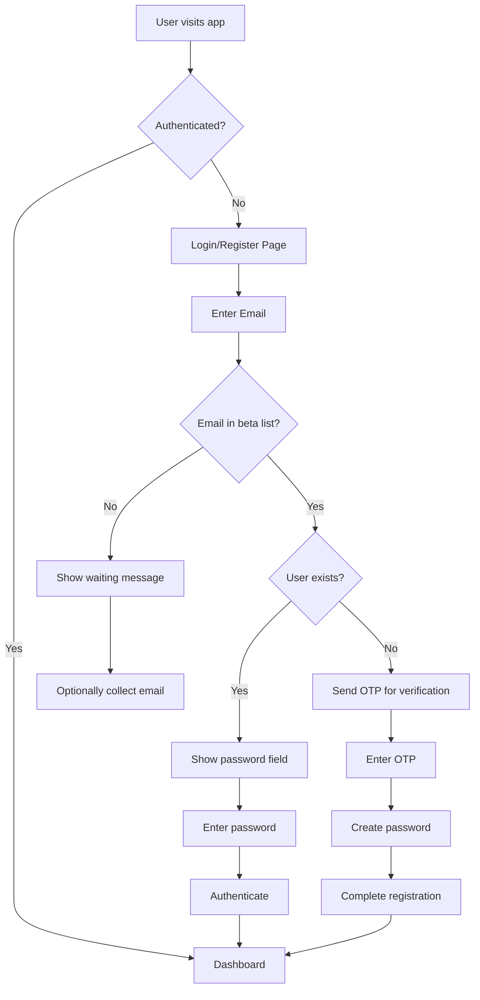

# Authentication System PRD

**Phase 3: Authentication Implementation**

## Executive Summary

This document outlines the implementation of a comprehensive authentication system for our AI chat application using Supabase Auth. The system will transition from anonymous usage to authenticated user sessions, enabling secure conversation management and proper user data association.

## Table of Contents

1. [Executive Summary](#executive-summary)
2. [Project Overview](#project-overview)
3. [Technical Requirements](#technical-requirements)
4. [Database Schema](#database-schema)
5. [Authentication Flow](#authentication-flow)
6. [Implementation Architecture](#implementation-architecture)
7. [User Experience](#user-experience)
8. [Security Considerations](#security-considerations)
9. [Future Considerations](#future-considerations)
10. [Success Metrics](#success-metrics)

## Project Overview

### Current State

- Frontend: Next.js 15 with TypeScript, TailwindCSS, and shadcn/ui
- Backend: FastAPI Python server communicating with LangGraph
- Database: Placeholder structure without real authentication
- User Management: Anonymous sessions only

### Target State

- Secure authentication using Supabase Auth
- Email/OTP-based login system
- Beta user whitelist management
- Persistent user sessions
- User-associated conversation threads
- Proper access control and security policies

### Key Objectives

1. **Security**: Implement industry-standard authentication practices
2. **User Experience**: Seamless login/logout flow with minimal friction
3. **Scalability**: Foundation for future authentication features
4. **Beta Management**: Controlled access during beta phase
5. **Data Integrity**: Proper user-data association

## Technical Requirements

### Core Authentication Features

#### 1. Email/Password Authentication

- **Primary Method**: Email and password combination
- **Registration Flow**: OTP verification for email ownership, then password creation
- **Login Flow**: Email and password for existing users
- **OTP Delivery**: Supabase's built-in email service (registration only)
- **Email Template**: Default Supabase template (customizable later)
- **Token Verification**: Server-side OTP verification during registration
- **Session Management**: Supabase handles session lifecycle

#### 2. Beta Access Control

- **Whitelist Management**: Manual management via Supabase console
- **Pre-signup Validation**: Check email against beta list before OTP send
- **Registration Gate**: Only beta users can proceed to OTP verification
- **Non-beta Handling**: Informational message + optional email collection
- **Access Enforcement**: Prevent unauthorized access at application level

#### 3. Session Management

- **Session Storage**: Supabase Auth handles automatically
- **Session Validation**: Server-side validation on protected routes
- **Token Refresh**: Automatic refresh via Supabase client
- **Logout**: Complete session invalidation

#### 4. Rate Limiting

- **Approach**: Unlimited attempts initially (following industry standards)
- **Future Enhancement**: Implement rate limiting as needed

### Authentication Architecture

#### Frontend (Next.js)

```typescript
// lib/supabase/client.ts
import { createClient } from "@supabase/supabase-js";

const supabaseUrl = process.env.NEXT_PUBLIC_SUPABASE_URL!;
const supabaseAnonKey = process.env.NEXT_PUBLIC_SUPABASE_ANON_KEY!;

export const supabase = createClient(supabaseUrl, supabaseAnonKey);
```

#### Backend Communication Pattern

- **Frontend ↔ Backend**: All communication through our FastAPI server
- **Backend ↔ Supabase**: Server-side authentication validation
- **No Direct FE-Supabase**: Frontend does not directly communicate with Supabase for data operations

#### Authentication Context

```typescript
// lib/auth-context.tsx
"use client";

import React, { createContext, useContext, useState, useEffect } from "react";
import { User, Session } from "@supabase/supabase-js";
import { supabase } from "./supabase/client";

interface AuthContext {
  user: User | null;
  session: Session | null;
  loading: boolean;
  signIn: (email: string, password: string) => Promise<void>;
  signUp: (email: string, password: string, otp: string) => Promise<void>;
  signOut: () => Promise<void>;
  sendOTP: (email: string) => Promise<void>;
}

const AuthContext = createContext<AuthContext | undefined>(undefined);

export function AuthProvider({ children }: { children: React.ReactNode }) {
  const [user, setUser] = useState<User | null>(null);
  const [session, setSession] = useState<Session | null>(null);
  const [loading, setLoading] = useState(true);

  useEffect(() => {
    // Get initial session
    supabase.auth.getSession().then(({ data: { session } }) => {
      setSession(session);
      setUser(session?.user ?? null);
      setLoading(false);
    });

    // Listen for auth changes
    const {
      data: { subscription },
    } = supabase.auth.onAuthStateChange(async (event, session) => {
      setSession(session);
      setUser(session?.user ?? null);
      setLoading(false);
    });

    return () => subscription.unsubscribe();
  }, []);

  const signIn = async (email: string, password: string) => {
    const { error } = await supabase.auth.signInWithPassword({
      email,
      password,
    });
    if (error) throw error;
  };

  const sendOTP = async (email: string) => {
    const { error } = await supabase.auth.signInWithOtp({
      email,
      options: {
        shouldCreateUser: false, // Beta users only
      },
    });
    if (error) throw error;
  };

  const signUp = async (email: string, password: string, otp: string) => {
    // First verify OTP, then create account
    const { error: verifyError } = await supabase.auth.verifyOtp({
      email,
      token: otp,
      type: "signup",
    });
    if (verifyError) throw verifyError;

    const { error: signUpError } = await supabase.auth.signUp({
      email,
      password,
    });
    if (signUpError) throw signUpError;
  };

  const signOut = async () => {
    await supabase.auth.signOut();
  };

  return (
    <AuthContext.Provider
      value={{
        user,
        session,
        loading,
        signIn,
        signUp,
        signOut,
        sendOTP,
      }}
    >
      {children}
    </AuthContext.Provider>
  );
}

export function useAuth() {
  const context = useContext(AuthContext);
  if (context === undefined) {
    throw new Error("useAuth must be used within an AuthProvider");
  }
  return context;
}
```

## Database Schema

### Core Tables

#### 1. beta_emails

```sql
CREATE TABLE public.beta_emails (
  id UUID PRIMARY KEY DEFAULT gen_random_uuid(),
  email TEXT UNIQUE NOT NULL,
  created_at TIMESTAMP WITH TIME ZONE DEFAULT NOW()
);

-- Enable RLS
ALTER TABLE public.beta_emails ENABLE ROW LEVEL SECURITY;

-- Policy: Only service role can read/write
CREATE POLICY "Service role access only" ON public.beta_emails
FOR ALL USING (auth.role() = 'service_role');
```

#### 2. user_profiles (Future Extension)

```sql
CREATE TABLE public.user_profiles (
  id UUID PRIMARY KEY REFERENCES auth.users(id) ON DELETE CASCADE,
  email TEXT NOT NULL,
  display_name TEXT,
  created_at TIMESTAMP WITH TIME ZONE DEFAULT NOW(),
  updated_at TIMESTAMP WITH TIME ZONE DEFAULT NOW()
);

-- Enable RLS
ALTER TABLE public.user_profiles ENABLE ROW LEVEL SECURITY;

-- Policy: Users can only access their own profile
CREATE POLICY "Users can view own profile" ON public.user_profiles
FOR SELECT USING (auth.uid() = id);

CREATE POLICY "Users can update own profile" ON public.user_profiles
FOR UPDATE USING (auth.uid() = id);
```

#### 3. Email Collection (Optional)

```sql
CREATE TABLE public.beta_requests (
  id UUID PRIMARY KEY DEFAULT gen_random_uuid(),
  email TEXT NOT NULL,
  requested_at TIMESTAMP WITH TIME ZONE DEFAULT NOW(),
  status TEXT DEFAULT 'pending' CHECK (status IN ('pending', 'approved', 'denied'))
);

-- Enable RLS
ALTER TABLE public.beta_requests ENABLE ROW LEVEL SECURITY;

-- Policy: Service role access only
CREATE POLICY "Service role access only" ON public.beta_requests
FOR ALL USING (auth.role() = 'service_role');
```

### Supabase Auth Configuration

#### Auth Settings

- **Email confirmation**: Required for registration
- **Double confirm email changes**: Enabled
- **Allow signup**: Disabled (beta-only access via backend)
- **Password Requirements** (Industry Standard - Safe but Not Overly Complex):
  - **Minimum length**: 8 characters
  - **Maximum length**: 128 characters (to prevent DoS attacks)
  - **Character requirements**: At least one lowercase letter (a-z)
  - **No complex requirements**: No requirements for uppercase, numbers, or special characters
  - **Prohibited passwords**: Common passwords blocked (e.g., "password", "12345678")
  - **No character repetition limits**: Allow repeated characters
  - **No expiration**: Passwords do not expire
  - **Rationale**: Following NIST 800-63B guidelines for user-friendly security

#### Password Validation Rules

```javascript
const passwordRequirements = {
  minLength: 8,
  maxLength: 128,
  requiresLowercase: true,
  requiresUppercase: false, // Not required - reduces friction
  requiresNumbers: false, // Not required - reduces friction
  requiresSpecialChars: false, // Not required - reduces friction
  allowedSpecialChars: "!@#$%^&*()_+-=[]{}|;:,.<>?",
  blockedPasswords: [
    "password",
    "12345678",
    "qwerty",
    "abc123",
    "password123",
    "admin",
    "letmein",
    "welcome",
  ],
};
```

#### Email Templates

- **OTP Template**: Default Supabase template for email verification
- **Customization**: Future enhancement for branded emails

## Authentication Flow

### 1. User Access Attempt



### 2. Authentication Flow Implementation

#### New User Registration Flow

1. **Email Entry**: User enters email address
2. **Beta Check**: Verify email is in beta list
3. **User Check**: Verify if user already exists in auth.users
4. **OTP Send**: If new user, send OTP to email for verification
5. **OTP Verification**: User enters OTP code
6. **Password Creation**: User creates password meeting requirements
7. **Account Creation**: Complete Supabase user registration
8. **Session Creation**: Automatic login after registration

#### Existing User Login Flow

1. **Email Entry**: User enters email address
2. **Beta Check**: Verify email is in beta list
3. **User Check**: Confirm user exists in auth.users
4. **Password Entry**: Show password field
5. **Authentication**: Verify credentials with Supabase
6. **Session Creation**: Create authenticated session

### 3. Session Validation

#### Protected Route Component

```typescript
// components/auth/protected-route.tsx
"use client";

import { useAuth } from "@/lib/auth-context";
import { useRouter } from "next/navigation";
import { useEffect } from "react";
import { Loader2 } from "lucide-react";

interface ProtectedRouteProps {
  children: React.ReactNode;
}

export function ProtectedRoute({ children }: ProtectedRouteProps) {
  const { user, loading } = useAuth();
  const router = useRouter();

  useEffect(() => {
    if (!loading && !user) {
      router.push("/login");
    }
  }, [user, loading, router]);

  if (loading) {
    return (
      <div className="min-h-screen bg-gradient-to-br from-black via-gray-900 to-black flex items-center justify-center">
        <div className="flex flex-col items-center space-y-4">
          <Loader2 className="h-8 w-8 animate-spin text-blue-400" />
          <p className="text-white/70">Loading...</p>
        </div>
      </div>
    );
  }

  if (!user) {
    return null; // Will redirect
  }

  return <>{children}</>;
}
```

### 4. Migration Strategy

#### No Migration Required

- **Approach**: Fresh implementation with new authentication system
- **Existing Users**: Dummy users will be removed; no migration needed
- **Data Handling**: Start with clean authentication slate
- **User Communication**: New users will register through proper beta process

#### Implementation Steps

1. Deploy new authentication system
2. Remove any existing dummy user data
3. Set up beta email list in Supabase
4. Configure password requirements and OTP settings
5. Test registration and login flows

## Implementation Architecture

### Component Structure

```
frontend/src/
├── app/
│   ├── (auth)/
│   │   ├── login/
│   │   │   └── page.tsx
│   │   └── register/
│   │       └── page.tsx
│   ├── dashboard/
│   │   └── page.tsx (protected)
│   ├── globals.css
│   └── layout.tsx
├── components/
│   ├── auth/
│   │   ├── login-form.tsx
│   │   ├── register-form.tsx
│   │   ├── otp-form.tsx
│   │   ├── protected-route.tsx
│   │   └── logout-button.tsx
│   └── ui/
│       ├── button.tsx
│       ├── card.tsx
│       ├── input.tsx
│       ├── form.tsx
│       └── label.tsx
├── lib/
│   ├── supabase/
│   │   ├── client.ts
│   │   ├── server.ts
│   │   └── middleware.ts
│   ├── auth-context.tsx
│   └── utils.ts
└── types/
    └── auth.ts
```

### Example Components

#### Login Form Component

```typescript
// components/auth/login-form.tsx
"use client";

import { useState } from "react";
import { Button } from "@/components/ui/button";
import { Input } from "@/components/ui/input";
import { Label } from "@/components/ui/label";
import {
  Card,
  CardContent,
  CardDescription,
  CardHeader,
  CardTitle,
} from "@/components/ui/card";
import { useAuth } from "@/lib/auth-context";
import { useRouter } from "next/navigation";
import { Loader2 } from "lucide-react";

export function LoginForm() {
  const [email, setEmail] = useState("");
  const [password, setPassword] = useState("");
  const [isLoading, setIsLoading] = useState(false);
  const [step, setStep] = useState<"email" | "password" | "success">("email");
  const { signIn, sendOTP } = useAuth();
  const router = useRouter();

  const handleEmailSubmit = async (e: React.FormEvent) => {
    e.preventDefault();
    if (!email || !email.includes("@")) return;

    setIsLoading(true);
    try {
      // Check if user exists via backend API
      const response = await fetch("/api/auth/check-user", {
        method: "POST",
        headers: { "Content-Type": "application/json" },
        body: JSON.stringify({ email }),
      });

      const { exists, inBeta } = await response.json();

      if (!inBeta) {
        // Handle non-beta user
        return;
      }

      if (exists) {
        setStep("password");
      } else {
        await sendOTP(email);
        router.push("/register?email=" + encodeURIComponent(email));
      }
    } catch (error) {
      console.error("Email check error:", error);
    } finally {
      setIsLoading(false);
    }
  };

  const handlePasswordSubmit = async (e: React.FormEvent) => {
    e.preventDefault();
    if (!password) return;

    setIsLoading(true);
    try {
      await signIn(email, password);
      router.push("/dashboard");
    } catch (error) {
      console.error("Login error:", error);
    } finally {
      setIsLoading(false);
    }
  };

  return (
    <Card className="w-full max-w-md mx-auto bg-white/5 border-white/10 backdrop-blur-md">
      <CardHeader className="text-center">
        <CardTitle className="text-2xl text-white">Welcome Back</CardTitle>
        <CardDescription className="text-white/70">
          Sign in to access your account
        </CardDescription>
      </CardHeader>
      <CardContent>
        {step === "email" ? (
          <form onSubmit={handleEmailSubmit} className="space-y-4">
            <div className="space-y-2">
              <Label htmlFor="email" className="text-white/90">
                Email Address
              </Label>
              <Input
                id="email"
                type="email"
                placeholder="Enter your email"
                value={email}
                onChange={(e) => setEmail(e.target.value)}
                required
                className="bg-white/10 border-white/20 text-white placeholder:text-white/50 focus:border-blue-400"
              />
            </div>
            <Button
              type="submit"
              className="w-full bg-gradient-to-r from-blue-500 to-purple-600 hover:from-blue-600 hover:to-purple-700"
              disabled={isLoading || !email}
            >
              {isLoading ? (
                <>
                  <Loader2 className="mr-2 h-4 w-4 animate-spin" />
                  Checking...
                </>
              ) : (
                "Continue"
              )}
            </Button>
          </form>
        ) : (
          <form onSubmit={handlePasswordSubmit} className="space-y-4">
            <div className="space-y-2">
              <Label htmlFor="password" className="text-white/90">
                Password
              </Label>
              <Input
                id="password"
                type="password"
                placeholder="Enter your password"
                value={password}
                onChange={(e) => setPassword(e.target.value)}
                required
                className="bg-white/10 border-white/20 text-white placeholder:text-white/50 focus:border-blue-400"
              />
            </div>
            <Button
              type="submit"
              className="w-full bg-gradient-to-r from-blue-500 to-purple-600 hover:from-blue-600 hover:to-purple-700"
              disabled={isLoading || !password}
            >
              {isLoading ? (
                <>
                  <Loader2 className="mr-2 h-4 w-4 animate-spin" />
                  Signing in...
                </>
              ) : (
                "Sign In"
              )}
            </Button>
          </form>
        )}
      </CardContent>
    </Card>
  );
}
```

#### Registration Form Component

```typescript
// components/auth/register-form.tsx
"use client";

import { useState } from "react";
import { Button } from "@/components/ui/button";
import { Input } from "@/components/ui/input";
import { Label } from "@/components/ui/label";
import {
  Card,
  CardContent,
  CardDescription,
  CardHeader,
  CardTitle,
} from "@/components/ui/card";
import { useAuth } from "@/lib/auth-context";
import { useRouter, useSearchParams } from "next/navigation";
import { Loader2, Check, X } from "lucide-react";

interface PasswordRequirement {
  text: string;
  met: boolean;
}

export function RegisterForm() {
  const searchParams = useSearchParams();
  const email = searchParams.get("email") || "";
  const [otp, setOtp] = useState("");
  const [password, setPassword] = useState("");
  const [isLoading, setIsLoading] = useState(false);
  const [step, setStep] = useState<"otp" | "password" | "success">("otp");
  const { signUp } = useAuth();
  const router = useRouter();

  const getPasswordRequirements = (password: string): PasswordRequirement[] => [
    { text: "At least 8 characters", met: password.length >= 8 },
    { text: "Contains lowercase letter", met: /[a-z]/.test(password) },
    {
      text: "Not a common password",
      met: !["password", "12345678", "qwerty"].includes(password.toLowerCase()),
    },
  ];

  const handleOtpSubmit = async (e: React.FormEvent) => {
    e.preventDefault();
    if (!otp || otp.length !== 6) return;
    setStep("password");
  };

  const handlePasswordSubmit = async (e: React.FormEvent) => {
    e.preventDefault();
    const requirements = getPasswordRequirements(password);
    if (!requirements.every((req) => req.met)) return;

    setIsLoading(true);
    try {
      await signUp(email, password, otp);
      setStep("success");
      setTimeout(() => router.push("/dashboard"), 2000);
    } catch (error) {
      console.error("Registration error:", error);
    } finally {
      setIsLoading(false);
    }
  };

  if (step === "success") {
    return (
      <Card className="w-full max-w-md mx-auto bg-white/5 border-white/10 backdrop-blur-md">
        <CardContent className="pt-6">
          <div className="text-center space-y-4">
            <div className="w-16 h-16 mx-auto bg-green-500/20 rounded-full flex items-center justify-center">
              <Check className="w-8 h-8 text-green-400" />
            </div>
            <h3 className="text-xl font-semibold text-white">
              Welcome to Alpha!
            </h3>
            <p className="text-white/70">Redirecting to your dashboard...</p>
          </div>
        </CardContent>
      </Card>
    );
  }

  return (
    <Card className="w-full max-w-md mx-auto bg-white/5 border-white/10 backdrop-blur-md">
      <CardHeader className="text-center">
        <CardTitle className="text-2xl text-white">Create Account</CardTitle>
        <CardDescription className="text-white/70">
          {step === "otp"
            ? "Check your email for the verification code"
            : "Create a secure password"}
        </CardDescription>
      </CardHeader>
      <CardContent>
        {step === "otp" ? (
          <form onSubmit={handleOtpSubmit} className="space-y-4">
            <div className="space-y-2">
              <Label htmlFor="otp" className="text-white/90">
                Verification Code
              </Label>
              <Input
                id="otp"
                type="text"
                placeholder="Enter 6-digit code"
                value={otp}
                onChange={(e) =>
                  setOtp(e.target.value.replace(/\D/g, "").slice(0, 6))
                }
                maxLength={6}
                className="bg-white/10 border-white/20 text-white placeholder:text-white/50 focus:border-blue-400 text-center text-lg tracking-widest"
              />
            </div>
            <Button
              type="submit"
              className="w-full bg-gradient-to-r from-blue-500 to-purple-600 hover:from-blue-600 hover:to-purple-700"
              disabled={otp.length !== 6}
            >
              Verify Code
            </Button>
          </form>
        ) : (
          <form onSubmit={handlePasswordSubmit} className="space-y-4">
            <div className="space-y-2">
              <Label htmlFor="password" className="text-white/90">
                Password
              </Label>
              <Input
                id="password"
                type="password"
                placeholder="Create a secure password"
                value={password}
                onChange={(e) => setPassword(e.target.value)}
                className="bg-white/10 border-white/20 text-white placeholder:text-white/50 focus:border-blue-400"
              />
              <div className="space-y-2 mt-3">
                {getPasswordRequirements(password).map((req, index) => (
                  <div
                    key={index}
                    className="flex items-center space-x-2 text-sm"
                  >
                    {req.met ? (
                      <Check className="w-4 h-4 text-green-400" />
                    ) : (
                      <X className="w-4 h-4 text-gray-400" />
                    )}
                    <span
                      className={req.met ? "text-green-400" : "text-gray-400"}
                    >
                      {req.text}
                    </span>
                  </div>
                ))}
              </div>
            </div>
            <Button
              type="submit"
              className="w-full bg-gradient-to-r from-blue-500 to-purple-600 hover:from-blue-600 hover:to-purple-700"
              disabled={
                isLoading ||
                !getPasswordRequirements(password).every((req) => req.met)
              }
            >
              {isLoading ? (
                <>
                  <Loader2 className="mr-2 h-4 w-4 animate-spin" />
                  Creating Account...
                </>
              ) : (
                "Create Account"
              )}
            </Button>
          </form>
        )}
      </CardContent>
    </Card>
  );
}
```

## Backend Integration

### Current Backend Structure

```
backend/
├── app/
│   ├── main.py                 # FastAPI app setup
│   │   └── app.py             # FastAPI app setup
│   ├── api/
│   │   ├── langgraph.py       # LangGraph API routes
│   │   └── auth.py            # NEW: Authentication routes
│   ├── services/
│   │   ├── langgraph_client.py # LangGraph service
│   │   ├── supabase_client.py  # NEW: Supabase service
│   │   └── auth_service.py     # NEW: Authentication service
│   ├── core/
│   │   ├── config.py          # Configuration settings
│   │   ├── security.py        # NEW: JWT validation & security
│   │   └── dependencies.py    # NEW: Authentication dependencies
│   └── models/
│       ├── auth.py            # NEW: Authentication models
│       └── user.py            # NEW: User models
├── requirements.txt
└── env.template
```

### New Authentication Components

#### 1. Updated Configuration (core/config.py)

```python
# app/core/config.py
from pydantic_settings import BaseSettings
from typing import Optional

class Settings(BaseSettings):
    # Assistant UI Cloud (Public)
    assistant_ui_cloud_url: str = "https://proj-0sacnnij1jo5.assistant-api.com"

    # LangGraph Configuration
    langgraph_api_url: str = "http://localhost:2024"  # Local dev
    langgraph_api_key: str = ""  # Empty for local, required for cloud

    # Supabase Configuration
    supabase_url: str
    supabase_service_role_key: str
    supabase_anon_key: str

    # JWT Configuration
    jwt_secret_key: str = ""  # Auto-populated from Supabase
    jwt_algorithm: str = "RS256"
    jwt_audience: str = "authenticated"

    # Environment
    environment: str = "development"
    host: str = "0.0.0.0"
    port: int = 8000

    class Config:
        env_file = ".env"

settings = Settings()
```

#### 2. Supabase Client Service (services/supabase_client.py)

```python
# app/services/supabase_client.py
from supabase import create_client, Client
from app.core.config import settings

class SupabaseClient:
    def __init__(self):
        self.client: Client = create_client(
            settings.supabase_url,
            settings.supabase_service_role_key
        )

    async def check_beta_user(self, email: str) -> bool:
        """Check if email is in beta list"""
        try:
            result = self.client.table("beta_emails").select("email").eq("email", email).execute()
            return len(result.data) > 0
        except Exception as e:
            print(f"Error checking beta user: {e}")
            return False

    async def user_exists(self, email: str) -> bool:
        """Check if user exists in auth.users"""
        try:
            result = self.client.auth.admin.list_users()
            return any(user.email == email for user in result)
        except Exception as e:
            print(f"Error checking user existence: {e}")
            return False

    async def collect_beta_request(self, email: str) -> bool:
        """Store email for future beta access"""
        try:
            self.client.table("beta_requests").insert({"email": email}).execute()
            return True
        except Exception as e:
            print(f"Error storing beta request: {e}")
            return False

# Global instance
supabase_client = SupabaseClient()
```

#### 3. Authentication Service (services/auth_service.py)

```python
# app/services/auth_service.py
from typing import Optional, Dict, Any
from fastapi import HTTPException, status
from app.services.supabase_client import supabase_client
from app.core.security import verify_jwt_token

class AuthService:
    def __init__(self):
        self.supabase = supabase_client

    async def check_user_status(self, email: str) -> Dict[str, Any]:
        """Check if user is in beta and if they exist"""
        in_beta = await self.supabase.check_beta_user(email)
        exists = await self.supabase.user_exists(email) if in_beta else False

        return {
            "email": email,
            "in_beta": in_beta,
            "exists": exists
        }

    async def handle_non_beta_user(self, email: str) -> Dict[str, str]:
        """Handle non-beta user email collection"""
        await self.supabase.collect_beta_request(email)
        return {
            "message": "You're not on the beta list yet. We'll notify you when spots open up!",
            "email_collected": True
        }

    async def validate_user_token(self, token: str) -> Dict[str, Any]:
        """Validate JWT token and return user info"""
        try:
            payload = verify_jwt_token(token)
            return {
                "user_id": payload.get("sub"),
                "email": payload.get("email"),
                "role": payload.get("role", "authenticated")
            }
        except Exception as e:
            raise HTTPException(
                status_code=status.HTTP_401_UNAUTHORIZED,
                detail="Invalid authentication credentials",
                headers={"WWW-Authenticate": "Bearer"},
            )

# Global instance
auth_service = AuthService()
```

#### 4. Security Module (core/security.py)

```python
# app/core/security.py
import jwt
from jwt import PyJWKClient
from fastapi import HTTPException, status
from typing import Dict, Any
from app.core.config import settings

# Initialize JWKS client for Supabase JWT verification
jwks_client = PyJWKClient(f"{settings.supabase_url}/auth/v1/jwks")

def verify_jwt_token(token: str) -> Dict[str, Any]:
    """Verify Supabase JWT token"""
    try:
        # Get signing key from Supabase
        signing_key = jwks_client.get_signing_key_from_jwt(token)

        # Decode and verify token
        payload = jwt.decode(
            token,
            signing_key.key,
            algorithms=[settings.jwt_algorithm],
            audience=settings.jwt_audience,
            issuer=f"{settings.supabase_url}/auth/v1"
        )

        return payload
    except jwt.ExpiredSignatureError:
        raise HTTPException(
            status_code=status.HTTP_401_UNAUTHORIZED,
            detail="Token has expired"
        )
    except jwt.InvalidTokenError:
        raise HTTPException(
            status_code=status.HTTP_401_UNAUTHORIZED,
            detail="Invalid token"
        )
```

#### 5. Authentication Dependencies (core/dependencies.py)

```python
# app/core/dependencies.py
from fastapi import Depends, HTTPException, status
from fastapi.security import HTTPBearer, HTTPAuthorizationCredentials
from typing import Dict, Any
from app.services.auth_service import auth_service

security = HTTPBearer()

async def get_current_user(
    credentials: HTTPAuthorizationCredentials = Depends(security)
) -> Dict[str, Any]:
    """Get current authenticated user from JWT token"""
    return await auth_service.validate_user_token(credentials.credentials)

async def get_current_user_optional(
    credentials: HTTPAuthorizationCredentials = Depends(HTTPBearer(auto_error=False))
) -> Dict[str, Any] | None:
    """Get current user if token is provided, otherwise return None"""
    if credentials is None:
        return None

    try:
        return await auth_service.validate_user_token(credentials.credentials)
    except HTTPException:
        return None
```

#### 6. Authentication Models (models/auth.py)

```python
# app/models/auth.py
from pydantic import BaseModel, EmailStr
from typing import Optional

class EmailCheckRequest(BaseModel):
    email: EmailStr

class EmailCheckResponse(BaseModel):
    email: str
    in_beta: bool
    exists: bool

class NonBetaUserResponse(BaseModel):
    message: str
    email_collected: bool

class UserInfo(BaseModel):
    user_id: str
    email: str
    role: str
```

#### 7. Authentication Routes (api/auth.py)

```python
# app/api/auth.py
from fastapi import APIRouter, HTTPException, Depends
from typing import Dict, Any
from app.models.auth import EmailCheckRequest, EmailCheckResponse, NonBetaUserResponse
from app.services.auth_service import auth_service
from app.core.dependencies import get_current_user

router = APIRouter(prefix="/api/auth", tags=["authentication"])

@router.post("/check-user", response_model=EmailCheckResponse)
async def check_user_status(request: EmailCheckRequest):
    """Check if user is in beta and exists"""
    try:
        result = await auth_service.check_user_status(request.email)
        return EmailCheckResponse(**result)
    except Exception as e:
        raise HTTPException(status_code=500, detail=str(e))

@router.post("/non-beta-request", response_model=NonBetaUserResponse)
async def handle_non_beta_request(request: EmailCheckRequest):
    """Handle email collection for non-beta users"""
    try:
        result = await auth_service.handle_non_beta_user(request.email)
        return NonBetaUserResponse(**result)
    except Exception as e:
        raise HTTPException(status_code=500, detail=str(e))

@router.get("/me")
async def get_current_user_info(current_user: Dict[str, Any] = Depends(get_current_user)):
    """Get current user information"""
    return {
        "user_id": current_user["user_id"],
        "email": current_user["email"],
        "role": current_user["role"]
    }
```

#### 8. Updated LangGraph Routes (api/langgraph.py)

```python
# app/api/langgraph.py - Updated with authentication
from fastapi import APIRouter, HTTPException, Depends
from fastapi.responses import StreamingResponse
from pydantic import BaseModel
from typing import List, Dict, Any, Optional
import json

from app.services.langgraph_client import langgraph_client
from app.core.dependencies import get_current_user

router = APIRouter(prefix="/api", tags=["langgraph"])

class CreateThreadRequest(BaseModel):
    pass  # No additional params needed

class CreateThreadResponse(BaseModel):
    thread_id: str

class SendMessageRequest(BaseModel):
    messages: List[Dict[str, Any]]

@router.post("/threads", response_model=CreateThreadResponse)
async def create_thread(
    request: CreateThreadRequest,
    current_user: Dict[str, Any] = Depends(get_current_user)
):
    """Create a new thread associated with authenticated user"""
    try:
        result = await langgraph_client.create_thread(user_id=current_user["user_id"])
        return CreateThreadResponse(thread_id=result["thread_id"])
    except Exception as e:
        raise HTTPException(status_code=500, detail=str(e))

@router.get("/threads/{thread_id}")
async def get_thread_state(
    thread_id: str,
    current_user: Dict[str, Any] = Depends(get_current_user)
):
    """Get thread state (user can only access their own threads)"""
    print(f"[DEBUG] Getting thread state for thread_id: {thread_id}, user: {current_user['user_id']}")
    try:
        state = await langgraph_client.get_thread_state(thread_id, current_user["user_id"])
        print(f"[DEBUG] Successfully retrieved state for thread_id: {thread_id}")
        return state
    except Exception as e:
        print(f"[ERROR] Failed to get thread state for {thread_id}: {e}")
        raise HTTPException(status_code=500, detail=str(e))

@router.post("/threads/{thread_id}/stream")
async def stream_messages(
    thread_id: str,
    request: SendMessageRequest,
    current_user: Dict[str, Any] = Depends(get_current_user)
):
    """Stream messages with LangGraph (authenticated users only)"""

    async def event_stream():
        try:
            print(f"[DEBUG] Streaming to thread_id={thread_id}, user={current_user['user_id']}")
            async for event in langgraph_client.stream_messages(
                thread_id, request.messages, current_user["user_id"]
            ):
                yield f"data: {json.dumps(event)}\n\n"
        except Exception as e:
            error_event = {"type": "error", "data": {"message": str(e)}}
            yield f"data: {json.dumps(error_event)}\n\n"

    return StreamingResponse(
        event_stream(),
        media_type="text/plain",
        headers={
            "Cache-Control": "no-cache",
            "Connection": "keep-alive",
            "Access-Control-Allow-Origin": "*",
        }
    )
```

#### 9. Updated Main Application (main.py)

```python
# app/main.py - Updated with authentication
from fastapi import FastAPI
from fastapi.middleware.cors import CORSMiddleware

from app.api.langgraph import router as langgraph_router
from app.api.auth import router as auth_router
from app.core.config import settings

app = FastAPI(
    title="Assistant UI LangGraph Backend",
    description="FastAPI backend for Assistant UI + LangGraph integration with Authentication",
    version="1.0.0"
)

# CORS
app.add_middleware(
    CORSMiddleware,
    allow_origins=["*"],  # Configure appropriately for production
    allow_credentials=True,
    allow_methods=["*"],
    allow_headers=["*"],
)

# Include routers
app.include_router(auth_router)      # NEW: Authentication routes
app.include_router(langgraph_router) # Existing: LangGraph routes

@app.get("/")
async def root():
    return {
        "message": "Assistant UI LangGraph Backend with Authentication",
        "status": "running",
        "environment": settings.environment
    }

@app.get("/health")
async def health():
    return {"status": "healthy"}
```

### Environment Configuration Updates

#### Backend (.env)

```bash
# Existing configuration
ASSISTANT_UI_CLOUD_URL=https://proj-0sacnnij1jo5.assistant-api.com
LANGGRAPH_API_URL=http://localhost:2024
LANGGRAPH_API_KEY=

# New Supabase configuration
SUPABASE_URL=your_supabase_project_url
SUPABASE_SERVICE_ROLE_KEY=your_service_role_key
SUPABASE_ANON_KEY=your_anon_key

# Environment
ENVIRONMENT=development
HOST=0.0.0.0
PORT=8000
```

#### Updated Requirements (requirements.txt)

```text
fastapi==0.104.1
uvicorn==0.24.0
pydantic==2.5.0
pydantic-settings==2.1.0
langgraph-sdk==0.1.0
supabase==2.3.0
PyJWT==2.8.0
cryptography==41.0.7
```

## User Experience

### Registration Experience

1. **Landing**: New users visit app and see registration prompt
2. **Email Input**: Simple email input field with clear CTA
3. **Beta Check**: Immediate feedback on beta status
4. **OTP Verification**: Clear instructions to check email for OTP code
5. **Password Creation**: Secure password input with requirements shown
6. **Account Creation**: Automatic login after successful registration
7. **Error Handling**: Clear error messages and recovery options

### Login Experience

1. **Email Input**: Existing users enter email address
2. **Beta Check**: System verifies beta status and user existence
3. **Password Input**: Password field appears for existing users
4. **Authentication**: Immediate login with valid credentials
5. **Dashboard Access**: Seamless redirect to dashboard
6. **Error Handling**: Clear error messages for invalid credentials

### Session Management

- **Auto-login**: Return users automatically authenticated
- **Session Expiry**: Graceful handling of expired sessions
- **Logout**: Clear logout option in navigation
- **Session Persistence**: Sessions persist across browser restarts

### Non-Beta User Experience

- **Clear Messaging**: "You're not on the beta list yet"
- **Hope & Timeline**: "We'll notify you when spots open up"
- **Optional Email**: Collect email for future notifications
- **No Frustration**: Avoid creating false expectations

### Password Requirements Display

- **Real-time Validation**: Show password strength as user types
- **Clear Requirements**: Display requirements upfront:
  - "At least 8 characters"
  - "Must contain at least one lowercase letter"
  - "Cannot be a common password"
- **Visual Feedback**: Green checkmark for minimum length and lowercase requirement
- **Strength Indicator**: Simple progress bar showing password strength
- **Error Prevention**: Disable submit until minimum requirements met
- **User-Friendly**: No complex requirements that frustrate users

## Security Considerations

### Authentication Security

#### Row Level Security (RLS)

```sql
-- Enable RLS on all user tables
ALTER TABLE user_profiles ENABLE ROW LEVEL SECURITY;

-- Users can only access their own data
CREATE POLICY "Users can view own data" ON user_profiles
FOR SELECT USING (auth.uid() = id);

CREATE POLICY "Users can update own data" ON user_profiles
FOR UPDATE USING (auth.uid() = id);
```

#### JWT Token Validation

```python
import jwt
from jwt import PyJWKClient

jwks_client = PyJWKClient(f"{SUPABASE_URL}/auth/v1/jwks")

def verify_supabase_token(token: str):
    """Verify Supabase JWT token"""
    try:
        signing_key = jwks_client.get_signing_key_from_jwt(token)
        decoded_token = jwt.decode(
            token,
            signing_key.key,
            algorithms=["RS256"],
            audience="authenticated",
            issuer=f"{SUPABASE_URL}/auth/v1"
        )
        return decoded_token
    except Exception:
        raise HTTPException(status_code=401, detail="Invalid token")
```

#### Session Security

- **Secure Cookies**: HTTPOnly, Secure, SameSite attributes
- **Token Refresh**: Automatic token refresh before expiry
- **Session Invalidation**: Complete cleanup on logout
- **CSRF Protection**: Built-in Supabase CSRF protection

### Data Protection

#### Environment Variables

- **No Hardcoding**: All secrets in environment variables
- **Service Role Key**: Server-side only, never exposed to frontend
- **Anon Key**: Public key with limited permissions

#### API Security

- **Authentication Required**: All protected endpoints require valid JWT
- **Input Validation**: Comprehensive input sanitization
- **Rate Limiting**: Future implementation for abuse prevention
- **CORS Configuration**: Proper CORS settings for production

## Future Considerations

### Immediate Follow-ups (Out of Scope for Phase 3)

#### Multi-Environment Setup

**What it entails:**

- Separate Supabase projects for dev/staging/prod
- Environment-specific configuration management
- Database migration strategies across environments
- CI/CD pipeline integration with multiple environments
- Environment-specific secret management

#### Social Authentication

**What it entails:**

- Google OAuth integration
- GitHub OAuth integration
- Provider-specific configuration and consent screens
- Account linking between social and email accounts
- Social profile data synchronization
- Provider-specific error handling

#### Advanced Security Features

**What it entails:**

- Multi-factor authentication (TOTP/SMS)
- Device management and trusted devices
- Login attempt monitoring and alerting
- IP-based access controls
- Suspicious activity detection
- Password policy enforcement (if adding password auth)

#### User Management Dashboard

**What it entails:**

- Admin interface for user management
- Beta user invitation system
- User activity monitoring
- Bulk user operations
- User support tools
- Analytics and reporting

### Long-term Enhancements

#### Advanced Authentication

- Multi-factor authentication
- Social login providers (Google, GitHub)
- SSO/SAML for enterprise customers
- Device management and trusted devices

#### User Management

- Admin dashboard for user management
- Automated beta invitation system
- User roles and permissions
- Organization/team features

#### Session Enhancements

- Advanced session management
- Multiple device sessions
- Session analytics and monitoring
- Suspicious activity detection

## Success Metrics

### Technical Metrics

- **Authentication Success Rate**: >95% successful logins
- **Session Stability**: <1% unexpected session terminations
- **Performance**: <2s login flow completion
- **Error Rate**: <5% authentication errors
- **Security**: Zero security incidents

### User Experience Metrics

- **Login Completion Rate**: >90% of users complete login flow
- **User Retention**: Baseline establishment for authenticated users
- **Support Tickets**: Minimal authentication-related support requests
- **Beta Satisfaction**: Positive feedback on beta access process

### Business Metrics

- **Beta Conversion**: Track non-beta email collections
- **User Engagement**: Increased session duration post-authentication
- **Feature Adoption**: Usage of authenticated-only features
- **Scalability**: System handles planned user growth

## Implementation Timeline

### Phase 3A: Core Authentication (Week 1)

- [ ] Supabase project setup and configuration
- [ ] Database schema implementation
- [ ] Basic authentication flow (frontend + backend)
- [ ] Beta email list management
- [ ] Testing and validation

### Phase 3B: Integration & Polish (Week 2)

- [ ] Frontend-backend integration
- [ ] Session management
- [ ] Error handling and edge cases
- [ ] User experience optimization
- [ ] Documentation and deployment

### Phase 3C: Migration & Launch (Week 3)

- [ ] Migration strategy implementation
- [ ] Production deployment
- [ ] User communication
- [ ] Monitoring and support
- [ ] Post-launch optimization

## Risk Mitigation

### Technical Risks

- **Supabase Service Outage**: Implement graceful degradation
- **Email Delivery Issues**: Monitor delivery rates and provide alternatives
- **Session Management Bugs**: Comprehensive testing of edge cases
- **Migration Data Loss**: Backup and rollback procedures

### User Experience Risks

- **Login Friction**: Optimize magic link flow
- **Beta Access Confusion**: Clear messaging and documentation
- **Migration Disruption**: Proactive user communication
- **Mobile Experience**: Responsive design and mobile testing

### Security Risks

- **JWT Token Leakage**: Secure token handling procedures
- **Session Hijacking**: Proper session security implementation
- **Unauthorized Access**: Comprehensive access control testing
- **Data Exposure**: RLS policy validation and testing

## Conclusion

This comprehensive authentication system will provide a secure, scalable foundation for user management while maintaining an excellent user experience. The phased approach ensures manageable implementation while the detailed security considerations protect user data and system integrity.

The system leverages Supabase Auth's proven infrastructure while maintaining flexibility for future enhancements and custom business logic. The beta access control ensures a controlled rollout while the migration strategy minimizes user disruption.

Success will be measured through technical performance, user satisfaction, and business metrics, with continuous monitoring and optimization to ensure long-term success.
